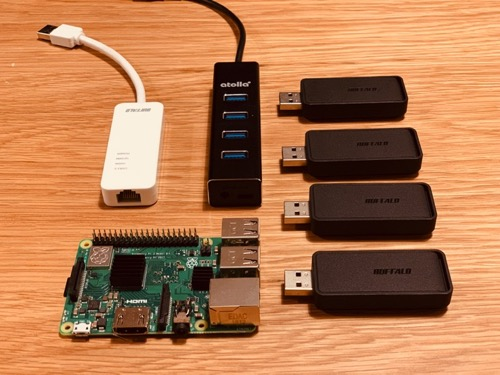

# RDBOX (A Robotics Developers BOX)

**RDBOX** is a powerful partner in the IT field for ["ROS \(Robot Operating System\) robots"](http://wiki.ros.org/). You will be able to automatically construct a secure, highly scalable Wi-Fi network and [Kubernetes](https://kubernetes.io/) cluster for container applications. For example, You will get a simpler and creative development experience than [deploying with traditional roslaunch](http://wiki.ros.org/roslaunch). Furthermore, it becomes easy to control a lot of groups of robots. Make Robot Engineers' Work a Lot Easier. You can control Network Robot with ease by **RDBOX**

## Features

### **Orchestrate all resources** running "ROS robots".

* Orchestrate ROS nodes on robots and conputer resources by [Kubernetes](https://kubernetes.io/).
    - **Allow mixing of x86 and ARM architecture CPU.**
    - k8s master will run on AWS EC2 or VirtualBox on your PC.
* Connect with the robots and others by [Mesh Wi-Fi Network](https://www.open-mesh.org/projects/open-mesh/wiki).
* Connect with the Clouds/On-Premise by [VPN Network](https://github.com/SoftEtherVPN/SoftEtherVPN_Stable).

### **Make It yourself!!**

* The RDBOX Edge devices builds with Raspberry Pi 3B.
* There is no worry that the back port will be installed. (All source code and hardware are disclosed.)
* Raspberry Pi provides you edge computing and Wi-Fi network and environmental sensors and more.
* Provide assembly procedure and original SD card image.

### **NETWORK CONNECT**
* Easily set up a dedicated local area network for robots.
    - Simply connect RDBOX in between the internet and your service robot. In one simple step, you can build a local area network and development environment. No knowledge of internet or networking is necessary.
* Many network applications, including NTP, are offered with the product. Automate your network robot management.
* All you need is a power source. Cover the whole movable range of mobile robots with a Wi-Fi network.

## Getting Started

If you just want to try RDBOX out, check out the [Our Wiki page](../../wiki) to give it a whirl.
* If you own [TurtleBot3](http://emanual.robotis.com/docs/en/platform/turtlebot3/overview/), you can also experience the deployment of ROS applications.
* Otherwise, you can learn the procedure for building development environment with RDBOX.

## Components

### Our Components
* [go\-transproxy](https://github.com/rdbox-intec/go-transproxy)
   - Transparent proxy servers for HTTP, HTTPS, DNS and TCP.
* [rdbox\-middleware](https://github.com/rdbox-intec/rdbox-middleware)
   - Middleware for RDBOX
* [image\-builder\-rpi](https://github.com/rdbox-intec/image-builder-rpi)
   - SD card image for Raspberry Pi with Docker: HypriotOS

### Third Components
* [hostapd](https://salsa.debian.org/debian/wpa)
   - hostapd is an IEEE 802.11 AP and IEEE 802.1X/WPA/WPA2/EAP/RADIUS Authenticator.
   - We are applying and applying [rour patch.](https://github.com/rdbox-intec/softether-patches)
* [SoftEtherVPN\_Stable](https://github.com/SoftEtherVPN/SoftEtherVPN_Stable) 
   - Open Cross-platform Multi-protocol VPN Software.
   - We are applying and applying [our patch.](https://github.com/rdbox-intec/wpa-patches)
- [bridge\-utils](https://git.kernel.org/pub/scm/linux/kernel/git/shemminger/bridge-utils.git/)
   - Utilities for configuring the Linux Ethernet bridge.
- [dnsmasq](http://www.thekelleys.org.uk/dnsmasq/doc.html)
   - network services for small networks.
- [nfs](http://nfs.sourceforge.net/)
   - support for NFS kernel server.
- etc.....

## Licence
Licensed under the [MIT](/LICENSE) license.